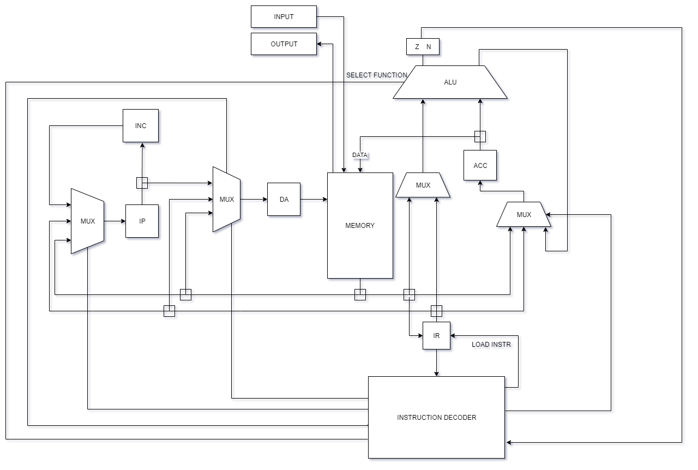

# Lab 3 по дисциплине Архитектура компьютера

- Сударушкин Ярослав, P33101
- ```asm | acc | neum | hw | instr | binary | stream | mem | prob2```

# Язык программирования
```bnf
<program> ::= 
        "section data:" <next_line>* <data_section>?
        <whitespace> 
        "section text:" <next_line>* <instruction_section>?
        
<data_section> ::= <label_declaration> <whitespace> <data>

<data> ::= (<char_literal> | <number>) ("," (<char_literal> | <number>))*

<instruction_section> ::= <instruction> (<whitespace> <instruction>)*

<instruction> ::= (<label_declaration> <next_line>)? " " <letter>+ (" " (<argument>)?

<argument> ::= <addressing> ( <number> | <label> )

<addressing> ::= "#" | "$" | ""

<label_declaration> ::= <label> ":"

<label> ::= <letter>+

<char_literal> ::= "'" (<letter> | <digit> | <whitespace>)+ "'"

<letter> ::= <lower_letter> | <upper_letter>

<lower_letter> ::= [a-z]

<upper_letter> ::= [A-Z]

<whitespace> ::= " " | "\t"

<next_line> ::= "\n"

<number> ::= <digit> | ( ([1-9]) <digit>+ )

<digit> ::= [0-9]

<comment> ::= ";" (<letter> | <digit> | <whitespace>)*
```
Код выполняется последовательно

Комментарии идут после `;` до конца строки этот текст не будет восприниматься транслятором

Есть две секции: `section data` и `section text`, пишутся единственными в строке (обе обязательны):

`section data` секция, после которой идет инициализации переменных по типу
<название переменной> значение в десятичной системе счисления или в `''` литералы или строка (массив литералов).

Есть служебные метки переменных: `IN` и `OUT`, которые используются для IO

`section text` секция, после которой идут инструкции. Есть обязательная метка `_start:`. Метки пишутся единственными на строку

Есть 3 типа адресации:
- ` ` Прямая 
- `$` Косвенная
- `#` Непосредственная загрузка 

пример кода hello world:
``` nasm
section data:
	hello: 'Hello World!',0
	i_char: hello

section text:
_start:
	ld $i_char
	cmp #0
	je end
	st OUT
	ld i_char
	add #1
	st i_char
	jmp _start

end:
	hlt
```
## Поддерживаемые команды:
- `NOP`  - ничего не делать
- `HLT` - остановка программы
- `LD X` - загрузка в `acc` из памяти
- `ST X`  - выгрузка из `acc` в память
- `ADD X`  - суммирование acc с 
- `SUB X` - вычитание из `acc` X
- `AND X`  - побитовое и `acc` и X
- `OR X` - побитовое или `acc` и X
- `DIV X` - целочисленное деление `acc` на X
- `MOD X` - остаток от деления `acc` на X
- `CMP X` - сравнение `acc` с X без сохранения результата (только флаги `Z` и `N`)
- `JE X` - переход к ячейке X, если `Z` = 1
- `JNE X` - переход к ячейке X, если `Z` = 0
- `JL X` - переход к ячейке X, если `N` = 1
- `JNL X` - переход к ячейке X, если `N` = 0
- `JMP X` - безусловный переход к ячейке X

# Организация памяти:

Модель памяти процессора

```text
i - number of instructions
d - size of data section

     Memory
+----------------------------+
| 00    : JMP _start (d)     |
| 01    : IN                 |
| 02    : OUT                |
| 03    : variable 1         |
|    ...                     |
| d-1   : variable d         |
| d     : instruct 1         |
| d+1   : instruct 2         |
| d+2   : instruct 3         |
|    ...                     |
| d+i-1 : hlt                |
+----------------------------+

```

# Транслятор:
реализован в модуле [translator.py](./translator.py)

## Система команд Процессора

Особенности процессора:

- Инструкция - 32 бита
- 4 специализированных регистра

Модель памяти процессора:

- Память для данных и инструкций общая.
- Машинное слово -- 32 бита, знаковое. Линейное адресное пространство.
### Регистры

- ACC - аккумулятор, регистр, использующийся для хранения результата арифметической операции
- DR - Data Address - регистр, содержащий адрес
- IR - Instruction register - регистр, хранящий текущую инструкцию
- IP - Instruction pointer - регистр, содержащий адрес следующей инструкции, которая должна выполниться

Также у ALU есть 2 флага:
- Z - результат вычисления равняется 0
- N - результат вычисления отрицательное число, а также меньше, если сравнивались положительны числа

## Поддерживаемые инструкции:
Совпадают с поддерживаемым командами

Как кодируется команда:
```ascii

31     27    25                                              0  Bits
+------------------------------------------------------------+
|opcode| form |         Argument                             | 
+------------------------------------------------------------+
```

- Инструкции без аргумента

| Инструкция | Описание             | Количество тактов |
|:-----------|----------------------|-------------------|
| `nop`      | ничего не делать     | 1                 |
| `hlt`      | завершение программы | 1                 |

- Обычный инструкции с аргументами

| Инструкция | Описание                                                                 | Количество тактов         |        |           |
|:-----------|--------------------------------------------------------------------------|---------------------------|--------|-----------|
|            | Тип адресации                                                            | Непосредственная загрузка | Прямая | Косвенная |  
| `ld`       | Загружает аргумент в аккумулятор                                         | 2                         | 3      | 4         |
| `st`       | Сохранять значение аккумулятора в память                                 | -                         | 3      | 4         |
| `cmp`      | Выставляет флаги по результату вычитания из аккумулятора аргумента       | 2                         | 3      | 4         |
| `add`      | Складывает аккумулятор со аргументом и сохраняет результат в аккумулятор | 2                         | 3      | 4         |
| `sub`      | Вычитает из аккумулятора аргумент и сохраняет результат в аккумулятор    | 2                         | 3      | 4         |
| `and`      | Побитовое или аккумулятора с аргументом и сохранение в аккумулятор       | 2                         | 3      | 4         |
| `or`       | Побитовое или аккумулятора с аргументом и сохранение в аккумулятор       | 2                         | 3      | 4         |
| `div`      | Нацело делит аккумулятор на аргумент и сохраняет результат в аккумулятор | 2                         | 3      | 4         |
| `mod`      | Сохраняет остаток от деления аккумулятора на аргумент в аккумулятор      | 2                         | 3      | 4         |

- Инструкции переходов

| Инструкция | Описание            | Количество тактов         |        |           |
|:-----------|---------------------|---------------------------|--------|-----------|
|            | Тип адресации       | Непосредственная загрузка | Прямая | Косвенная |  
| `jmp`      | безусловный переход | 2                         | 2      | 4         |
| `je`       | переход если Z=1    | 2                         | 2      | 4         |
| `jne`      | переход если Z=0    | 2                         | 2      | 4         |
| `jl`       | переход если N=1    | 2                         | 2      | 4         |
| `jnl`      | переход если N=0    | 2                         | 2      | 4         |


## Программа также выводится в виде мнемоник
Пример:
```nasm
JMP  17
     #0
     #0
     #72
     #101
     #108
     #108
     #111
     #32
     #87
     #111
     #114
     #108
     #100
     #33
     #0
     #3
 LD  $16
CMP  #0
 JE  25
 ST  2
 LD  16
ADD  #1
 ST  16
JMP  17
HLT  
```

# Модель процессора

Реализовано в модуле [machine.py](./machine.py)

#### DataPath & ControlUnit



#### ControlUnit

Реализован в классе `ControlUnit`.

- Hardwired (реализовано полностью на python).
- Моделирование на уровне инструкций.

Особенности работы модели:

- Для журнала состояний процессора используется стандартный модуль logging.
- Количество инструкций для моделирования ограничено hardcoded константой.
- Остановка моделирования осуществляется при помощи исключения:
  - `StopIteration` -- если выполнена инструкция `hlt`.
- Управление симуляцией реализовано в функции `simulate`.

## Апробация

| ФИО | алг.  | LoC | code байт| code инстр. | инстр. | такт.|
|--|-------| --- | ---------| ----------- | ------ | -----|
| Сударушкин | cat   | 11  | 36       | 9           | 124    | 323  |
| Ярослав | hello | 19  | 104      | 26          | 100    | 276  |
| Валентинович | prob2 | 62  | 232      | 58          | 543    | 1519 |

где:

- алг. -- название алгоритма (hello, cat, или как в варианте)
- LoC -- кол-во строк кода в реализации алгоритма
- code байт -- кол-во байт в машинном коде (если бинарное представление)
- code инстр. -- кол-во инструкций в машинном коде
- инстр. -- кол-во инструкций, выполненных при работе алгоритма
- такт. -- кол-во тактов, которое заняла работа алгоритма

1. [hello world](./examples/hello.asm) - выводит `Hello, world!` в stdin или out.txt.
2. [cat](./examples/cat.asm) - программа `cat`, повторяем ввод на выводе.
3. [prob2](./examples/prob2.asm) - problem 2

Интеграционные тесты реализованы тут: [integration_test](./integration_test.py)

CI:

``` yaml
lab3:
  stage: test
  image:
    name: python-tools
    entrypoint: [""]
  script:
    - python3-coverage run -m pytest --verbose
    - find . -type f -name "*.py" | xargs -t python3-coverage report
    - find . -type f -name "*.py" | xargs -t pycodestyle --ignore=E501
    - find . -type f -name "*.py" | xargs -t pylint

```

где:

- `python3-coverage` -- формирование отчёта об уровне покрытия исходного кода.
- `pytest` -- утилита для запуска тестов.
- `pycodestyle` -- утилита для проверки форматирования кода. `E501` (длина строк)
- `pylint` -- утилита для проверки качества кода. Некоторые правила отключены в отдельных модулях с целью упрощения кода.
- Docker image `python-tools` включает в себя все перечисленные утилиты. Его конфигурация: [Dockerfile](./Dockerfile).

Пример использования и журнал работы процессора на примере `prob2`:

```bash
> python3 translator.py examples/prob2.bin examples/prob5.txt
  Размер бинарного файла: 232 байта, что равняется 58 ячейкам

```

[prob2.txt](examples/prob2.txt)
[prob2.bin](examples/prob2.bin)

```bash

> ./machine.py examples/prob2.bin examples/input.txt
  Output:
    4613732
    instr_counter: 543 ticks: 1519
```

Полный текст вывода можно посмотреть [тут](./golden/prob2.yml)
